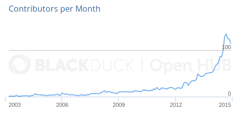
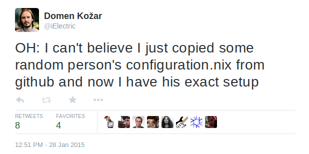

# NixOS

### Declarative configuration Linux distribution


### Basic information

- Distribution was made in 2008, package manager was created in 2004

- 388 contributors, 57000 commits

- hosted on https://github.com/NixOS/nixpkgs

- Community driven





### Sample `configuration.nix`

```nixos
{
  boot.loader.grub.device = "/dev/sda";
  fileSystems."/".device = "/dev/sda1";

  networking.firewall = {
    allowedTCPPorts = [ 80 631 ];
  };

  environment.systemPackages = [
    pkgs.wget
    pkgs.git
    pkgs.gnupg
  ];

  services.sshd.enable = true;
}
```





### Minimal installation

1. Download ISO from http://nixos.org/nixos/download.html and boot it
* `$ fdisk /dev/sda` (create one bootable partition)
* `$ mkfs.ext4 /dev/sda1`
* `$ mount /dev/sda1 /mnt`
* `$ nixos-generate-config --root /mnt`
* `$ $EDITOR /mnt/etc/nixos/configuration.nix`
* `$ nixos-install`
* `$ reboot`


# Hackable


- Nix language provides simple API to override packages and configuration that your distribution provides

```nix
nginx = pkgs.nginx.override { openssl = openssl102; }
```

Override source for a package

```nix
nginx = pkgs.nginx.overrideDerivation (attr:
  src = fetchgit { url = ".."; sha256 = ".."; }; 
})
```


### DevOps ready

Use NixOps to provision to different cloud providers:

- EC2
- Hetzner
- VirtualBox
- Google
- Azure (soon)
- None (TCP/IP)


# For Servers and Desktops

- We support KDE4, KDE5, Gnome3, XFCE, E18 desktops


# Stateless

It differs to other declarative configurations by how we manage state.

We don't inspect system state to activate new state of the
machine due to purely functional design.


### Rollback to any previous configuration

`nixos-rebuild switch --rollback` will revert to previous configuration


### Development friendly

Spawn a shell with given packages:

```$ nix-shell -p git -p python```

Think `virtualenv` on the package manager level


### Deterministic

For a given configuration file you always get the same system state.

We are also working on binary determinism.


### Source and binary packages

Packages are built from source, but we have a build farm that provides binary
packages.


### Rolling and stable release

- unstable channel is safe to use (you can always rollback)

- we also have half year stable releases: *14.12, 14.04, 13.10*
